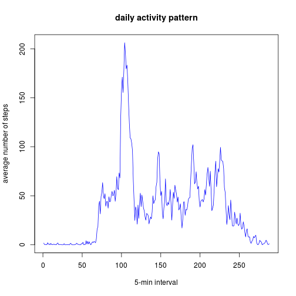
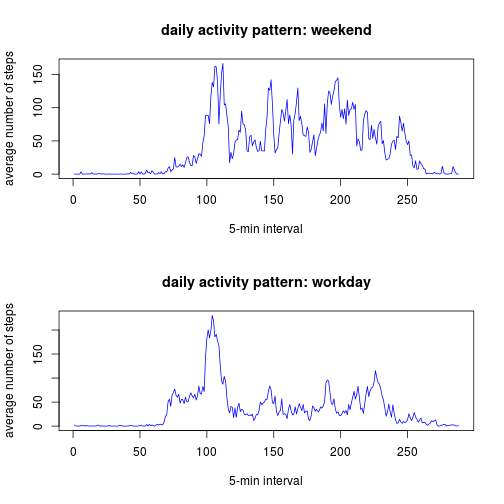

## Loading and preprocessing the data


```r
data <- read.csv("activity.csv")
```


## What is mean total number of steps taken per day?


```r
steps_per_day <- tapply(data$steps, data$date, sum)
hist(steps_per_day)
```

 

```r
mean(steps_per_day, na.rm = TRUE)
```

```
## [1] 10766
```

```r
median(steps_per_day, na.rm = TRUE)
```

```
## [1] 10765
```


## What is the average daily activity pattern?


```r
steps_per_int <- tapply(data$steps, data$interval, mean, na.rm = TRUE)
plot(steps_per_int, type = "l", col = "blue", main = "daily activity pattern", 
    xlab = "5-min interval", ylab = "average number of steps")
```

 


Which 5-minute interval, on average across all days in the dataset, contains the maximum number of steps? Minute of day of the interval start will be reported above the interval number:


```r
which(steps_per_int == max(steps_per_int))
```

```
## 835 
## 104
```


## Imputing missing values

Total number of missing values in the dataset:

```r
sum(is.na(data$steps))
```

```
## [1] 2304
```


Impute missing values by filing in the daily average of the interval:


```r
data$steps_imputed <- data$steps
data[is.na(data$steps), "steps_imputed"] <- steps_per_int
```


Histogram, mean and median of imputed steps per interval:


```r
steps_per_day_imp <- tapply(data$steps_imputed, data$date, sum)
hist(steps_per_day_imp)
```

 

```r
mean(steps_per_day_imp)
```

```
## [1] 10766
```

```r
median(steps_per_day_imp)
```

```
## [1] 10766
```


## Are there differences in activity patterns between weekdays and weekends?


```r
# this is independent of any languange environment; values 0..6, starting on
# Sunday, c.f. help
dayOfWeek <- as.POSIXlt(data$date)$wday
data_augm <- data.frame(date = data$date, interval = data$interval, steps = data$steps_imputed, 
    weekend = (dayOfWeek %in% c(6, 0)))


steps_per_int_wd <- tapply(data_augm$steps, list(data_augm$weekend, data_augm$interval), 
    mean, na.rm = TRUE)

par(mfrow = c(2, 1))
plot(steps_per_int_wd["TRUE", ], type = "l", col = "blue", main = "daily activity pattern: weekend", 
    xlab = "5-min interval", ylab = "average number of steps")
plot(steps_per_int_wd["FALSE", ], type = "l", col = "blue", main = "daily activity pattern: workday", 
    xlab = "5-min interval", ylab = "average number of steps")
```

 

